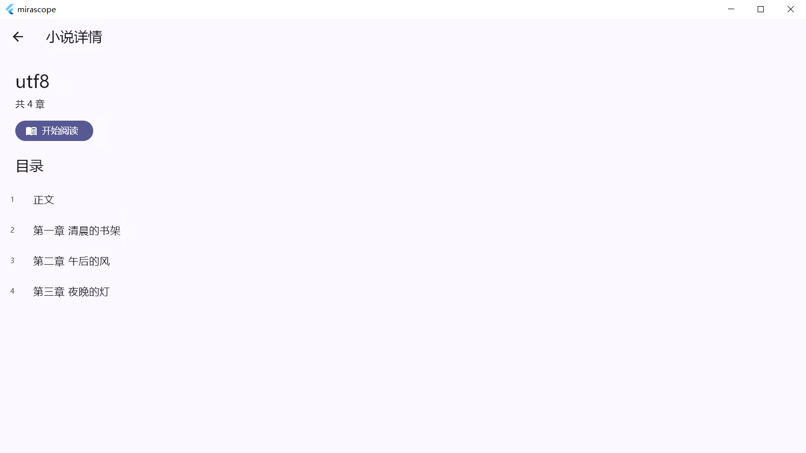
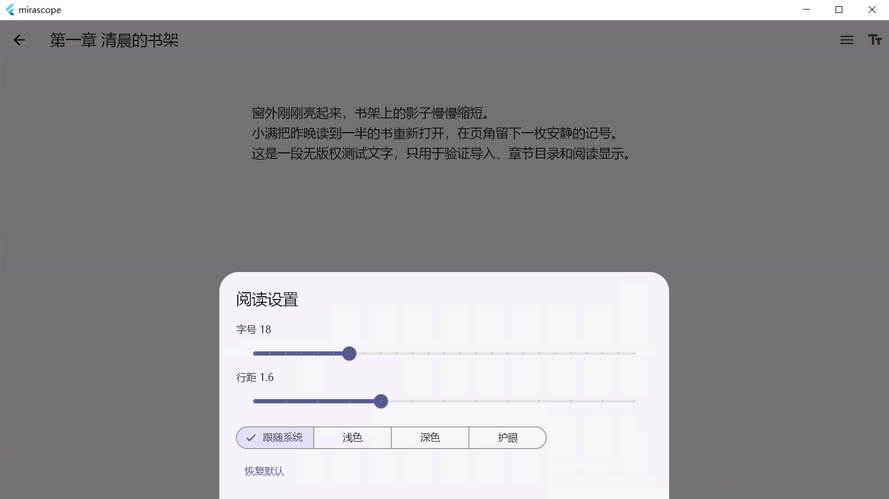

# mirascope

`mirascope` 是一个使用 Flutter 开发的本地优先个人阅读与媒体管理应用。文件留在用户设备上，应用负责可靠导入、章节组织、阅读设置、书签和进度恢复。

> 当前状态：`0.2.0+2` 发布候选开发中。Windows 与 Android 的 TXT/EPUB 阅读闭环、书签、双平台人工验收和 50 MiB TXT 性能复测已经完成；正式 Android 签名和 `v0.2.0` Release 尚未完成。

## 当前能力

已经实现：

- 单个 TXT 文件选择、元数据校验和流式 SHA-256 指纹；
- 未加密 EPUB 2/3 的结构解析、章节、语义正文和本地图片；
- UTF-8、UTF-16 LE/BE 和 GB18030 严格解码；
- 中英文常见章节识别与无章节回退；
- 媒体、媒体库、章节和导入记录的原子事务；
- 导入失败补偿、重复内容识别和安全错误反馈；
- 媒体库、归档与恢复；
- 小说详情、目录和纵向滚动阅读器；
- 字号、行距、跟随系统、浅色、深色和护眼主题；
- 章节与字符偏移进度持久化，使用 revision 防止旧写入覆盖新进度；
- TXT/EPUB 稳定位置书签的添加、跳转、持久化和删除；
- 原文件丢失检测和同指纹文件重新定位；
- Windows 与 Android 文件选择、阅读和核心交互；
- GitHub Actions 格式、静态分析、全量测试、Windows release 和 Android debug 构建；
- 100 KiB、5 MiB、50 MiB TXT 的可复现 AOT 性能基线。

尚未完成：

- 不同内容文件经用户确认后的安全原位重解析；
- Android 正式发布签名、商店安装包和 `v0.2.0` GitHub Release；
- 漫画、在线内容源、账号和同步。

完整限制见 [已知问题](docs/known-issues.md)。

## 核心路径

```text
导入 TXT
→ 确认书名或选择编码
→ 加入媒体库
→ 查看目录并开始阅读
→ 切换章节、滚动和调整显示
→ 关闭应用
→ 再次启动并恢复语义位置
```

来源文件移动后，应用保留媒体、章节、设置和进度；重新选择同一内容后恢复关联。不同指纹不会被静默替换。

## 工程重点

项目采用按 feature 组织的分层结构：

```text
Presentation  页面、交互和状态展示
      ↓
Application   导入、阅读、进度和重新定位用例
      ↓
Domain        平台无关模型与仓储契约
      ↓
Data          Drift、文件系统和平台插件实现
```

关键工程约束：

- 页面不直接执行 SQL 或解析文件；
- 用户原 TXT 不由应用修改或删除；
- 数据库与派生文本采用暂存、提升、事务和失败补偿；
- 日志不记录正文、标题、完整路径、原始异常或堆栈；
- 远期 Go、PostgreSQL 和 Rust 能力只有满足进入条件后才引入。

架构细节见 [技术架构](docs/tech-architecture.md) 和 [架构决策记录](docs/decisions/README.md)。

## 当前质量证据

最近一次本地检查：

```text
格式检查：通过
静态分析：0 问题
自动化测试：290/290 通过
```

最近一次远程质量门禁：

- Flutter `3.44.8` / Dart `3.12.2`；
- 通用质量检查通过；
- GitHub Windows release 与 Android debug APK 构建通过；
- [查看 MVP 0.2 布局候选 CI 记录](https://github.com/siokr/mirascope/actions/runs/31305783164)。

50 MiB TXT 当前 AOT 复测：

- 800 章；
- 导入中位数 `1565.328 ms`；
- 首次打开中位数 `68.469 ms`；
- RSS 增量中位数 `206.74 MiB`。

与 `v0.1.0` 同机基线相比没有阻塞发布的回归。完整环境和三次原始结果见 [当前性能报告](docs/performance/2026-08-09-txt-baseline.md)。

## 在 Windows 上运行

前置条件：

- Windows 10 或 11；
- Flutter stable，Dart 满足 `pubspec.yaml`；
- Visual Studio 2022，安装 **Desktop development with C++**；
- Git 和 PowerShell。

```powershell
git clone https://github.com/siokr/mirascope.git
cd mirascope
flutter doctor -v
flutter pub get
flutter run -d windows
```

执行开发质量检查：

```powershell
dart format --output=none --set-exit-if-changed lib test tool bin
flutter analyze
flutter test
flutter build windows --release
```

当前维护者机器存在 MSVC `HostX86 → x64` 选择后构建挂起的问题；GitHub 干净 Windows runner 可以成功构建。遇到类似问题请先阅读 [开发环境常见问题](docs/dev-setup.md#9-常见问题) 和 [已知问题](docs/known-issues.md)，不要直接清空 Flutter 缓存。

## 演示和验证

- [候选版本演示指南](docs/demo-guide.md)
- [MVP 任务与证据](docs/mvp-task-list.md)
- [质量策略](docs/quality-strategy.md)
- [MVP 0.2 候选版本记录](docs/releases/0.2.0-rc.1.md)
- [发布检查清单](docs/release-checklist.md)

### Windows 候选版实机截图

以下截图来自提交 `3d182ca` 构建的 `0.1.0+1` Windows 候选版，并在全新 Windows Sandbox 中使用无版权测试文本拍摄。






## 文档导航

建议按需求阅读：

1. [项目计划](plan.md)：版本范围和长期路线；
2. [MVP 执行清单](docs/mvp-task-list.md)：任务状态和验收证据；
3. [小说阅读规格](docs/novel-reader-spec.md)：TXT 导入与阅读规则；
4. [本地数据模型](docs/data-model.md)：实体、迁移和文件生命周期；
5. [技术架构](docs/tech-architecture.md)：边界和依赖方向；
6. [完整文档索引](docs/README.md)。

## 路线

| 版本 | 目标 | 平台 |
|---|---|---|
| MVP 0.1 | 本地 TXT 小说闭环 | Windows |
| MVP 0.2 | EPUB、Android、书签和公开 Release（候选收口中） | Windows、Android |
| Version 0.3 | 本地漫画导入与阅读 | 已支持平台 |
| Version 0.4 | 账号、设备和同步 | 客户端 + Go/PostgreSQL |

在线内容源、下载、番剧和 Rust 模块是候选方向，没有被包装成当前能力。

## 贡献与许可证

Issue 和讨论应说明问题属于哪个版本、如何验收、数据安全影响和维护成本。提交代码前请运行质量门槛，并避免提交商业小说、私人路径或敏感日志。

本项目采用 [MIT License](LICENSE) 开源。你可以使用、修改、分发和用于商业用途，但需要保留原始版权及许可证声明。随应用分发的第三方组件仍分别适用其各自许可证。
